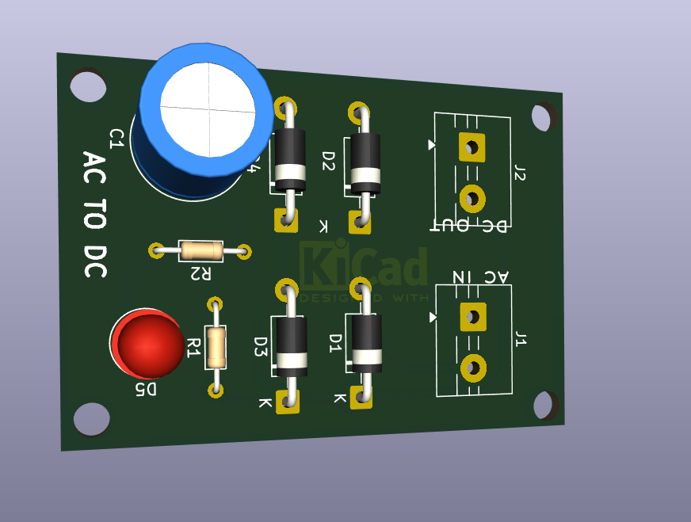

# ⚡ Day 1 - AC to DC Regulator PCB Design

## 🔧 Components Used
- resistor 
- Bridge Rectifier  
- Filter Capacitor  
- led
- screw terminals

## ⚙️ Key Functionalities
- AC to DC conversion  
- Ripple filtering  
- Voltage stabilization  

## 📘 Description
Designed a basic AC to DC regulator PCB focusing on clean layout and stable output.

## 🌍 Applications
- Power supply circuits  
- Embedded systems  

## 🚀 Future Improvements
- Protection circuits  
- Compact design  

## 📸 Preview

